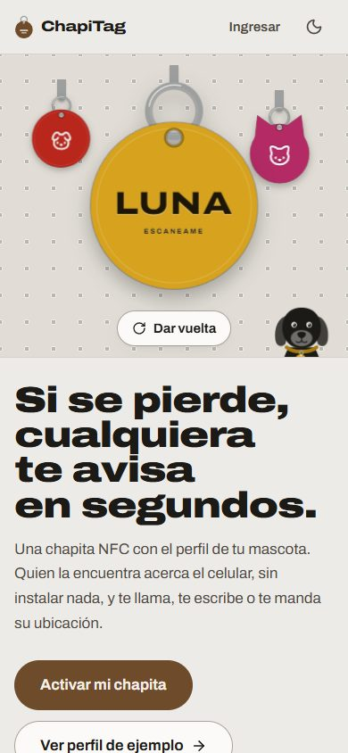
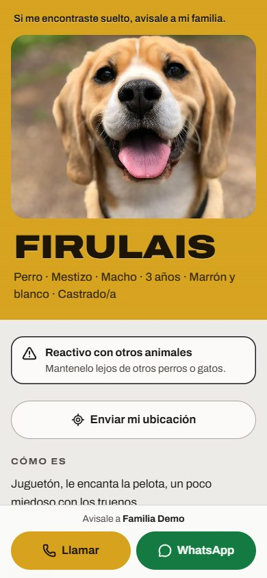
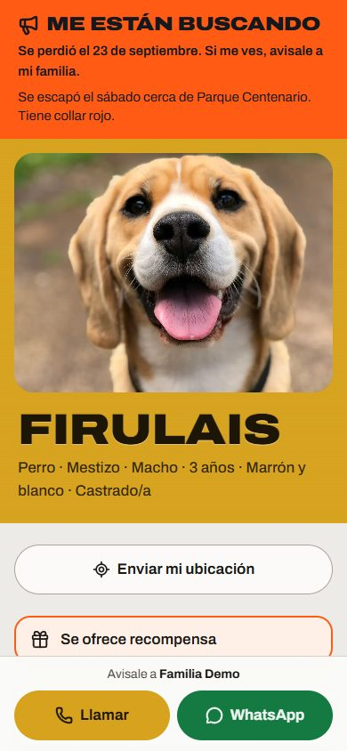
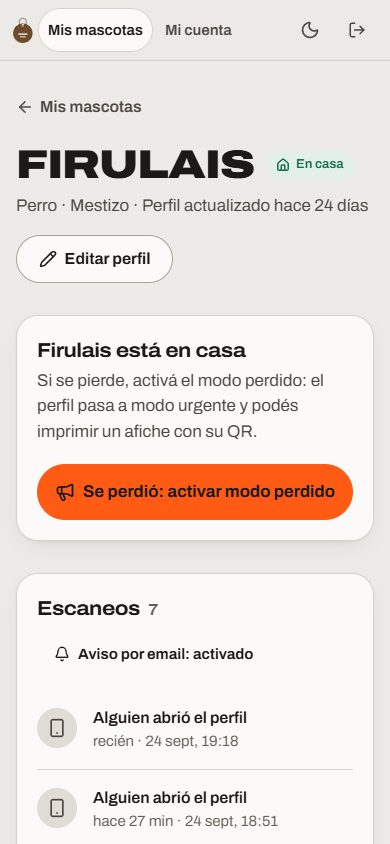
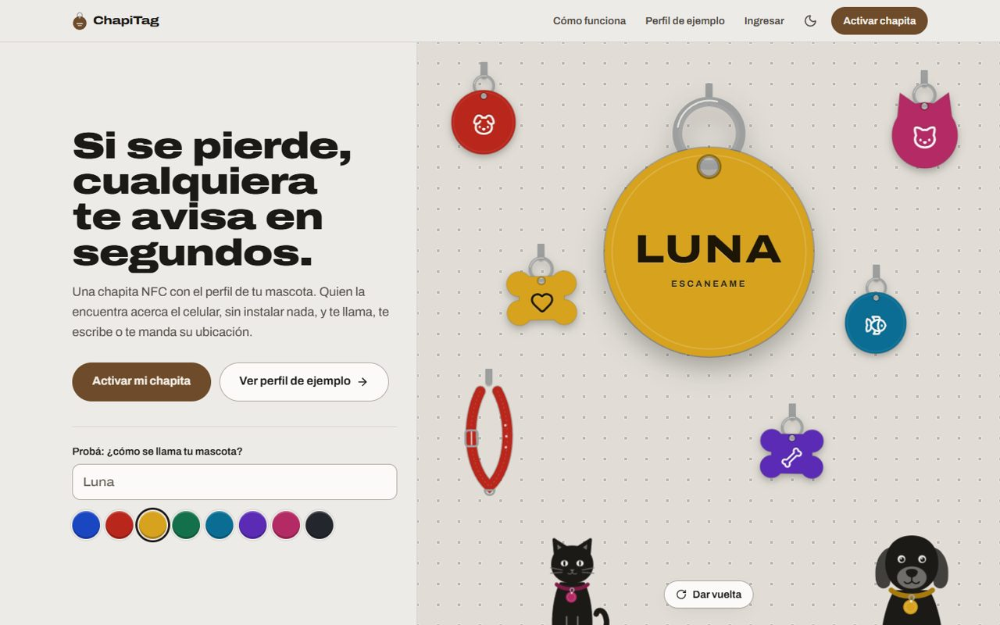
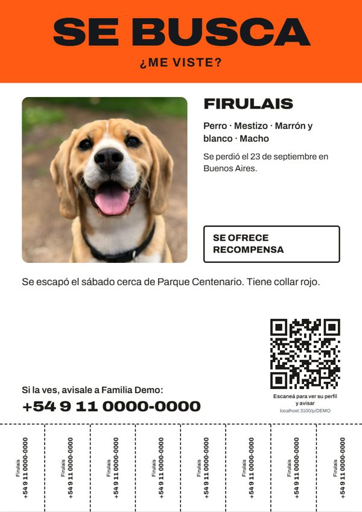

# ChapiTag · La chapita NFC que trae a tu mascota de vuelta

App web para chapitas NFC de mascotas, pensada para vender en Argentina. Cuando alguien encuentra a una mascota perdida, acerca el celular a la chapita (sin instalar nada) y se abre su perfil: foto, nombre, cuidados importantes y cómo avisarle a la familia por llamada, WhatsApp o Instagram, o mandándole su ubicación. El dueño se entera por email en el momento en que escanean la chapita.

El diseño sale de las chapitas de aluminio anodizado que se graban en el momento en veterinarias y cerrajerías: el color de cada chapita es la identidad de la mascota, el texto está "grabado" en metal y todo cuelga de un exhibidor perforado.

<p align="center">
  
  
  
  
</p>

<p align="center">
  
  <br>
  <sub>Inicio en la compu y afiche "Se busca" que se imprime desde el panel (datos de ejemplo).</sub>
</p>

---

## Qué hace

**Para quien encuentra a la mascota**

| | |
|---|---|
| **Perfil público** | Lo que abre la chapita (`/p/CÓDIGO`). La foto y el nombre mandan; llamar y WhatsApp quedan siempre abajo, al alcance del pulgar. Los cuidados importantes (medicación, reactivo con otros animales, necesidades especiales) aparecen primero. Siempre en modo claro, para leerse al sol. |
| **Enviar mi ubicación** | Con un botón comparte su ubicación GPS (y un mensaje, por ejemplo "la tengo en la esquina del kiosco"). Le llega al dueño por email con el link al mapa y queda en su panel. Después ofrece mandarla también por WhatsApp. |
| **Instagram** | Si el dueño cargó su usuario, aparece un botón para escribirle por Instagram. |
| **Sin app ni registro** | Funciona en el navegador de cualquier celular con NFC. Para los que no tienen NFC, la app genera un QR de respaldo para imprimir en la chapita o en el afiche. |

**Para el dueño**

| | |
|---|---|
| **Activar la chapita** | Con el código del dorso, o escaneando una chapita que todavía no está activada (el perfil vacío ofrece "Activar esta chapita"). |
| **Perfil personalizable** | Fotos (portada y galería), color de la chapita (8 anodizados), personalidad, insignias, salud, veterinaria, seguro, contacto alternativo, Instagram, recompensa y zona. Mientras lo editás ves la chapita grabada con el nombre y el color elegidos. |
| **Modo perdido** | Un botón y el perfil pasa a "Me están buscando", con tu mensaje y la recompensa arriba. Te avisamos por email en cada escaneo. |
| **Escaneos** | Historial de cada vez que se abrió el perfil y de las ubicaciones compartidas, con link al mapa. Los avisos por email se pueden apagar. |
| **Afiche "Se busca"** | A4 listo para imprimir (también en blanco y negro): foto, datos para reconocerla, teléfono, QR al perfil y tiras con el número para arrancar. |
| **Vista previa al compartir** | Al mandar el link por WhatsApp o redes se ve una tarjeta con la foto y el nombre; en modo perdido, con la franja "SE BUSCA". |
| **Reemplazar la chapita** | Si se pierde o se rompe, cargás el código de una nueva: la vieja queda dada de baja y no muestra tus datos. |
| **Cuenta** | Registro, ingreso, recuperar la contraseña por email y cambiar datos o contraseña (cierra las sesiones de los otros dispositivos). |

**Para el operador (admin)**

| | |
|---|---|
| **Lotes** | Genera lotes de códigos únicos (8 caracteres sin los que se confunden: sin 0/O ni 1/I/L). Cada lote se ve como una fila de chapitas: activadas, sin usar y dadas de baja. |
| **Imprenta y grabado** | Exporta un lote a CSV con la URL a grabar en cada chip e imprime una hoja A4 de QR (5×7) con el código debajo. |
| **Búsqueda y bajas** | Busca por código, mascota o email; filtra por estado o lote; da de baja chapitas perdidas o robadas (con confirmación). |

**Privacidad y seguridad**

- Los perfiles no aparecen en buscadores (`noindex`) y la dirección exacta solo se muestra si el dueño la activa.
- Las fotos se achican, pasan a WebP y se les borran los datos EXIF, incluida la ubicación GPS de donde se sacaron.
- Límite de intentos en el ingreso, la recuperación de contraseña y el envío de ubicaciones.
- El escaneo se registra desde el navegador: no cuentan los bots que arman la vista previa de un link ni el dueño mirando su propio perfil.

## Cómo funciona el NFC

La chapita no necesita programación especial ni una app propia: en el chip (NTAG213/215) se graba la URL pública de la mascota, por ejemplo `https://tudominio.com.ar/p/K7M2P9XQ`. Cualquier celular moderno abre esa URL al acercarlo.

1. Comprás chapitas NFC en blanco (se consiguen como stickers, tarjetas PVC o chapitas).
2. Desde **Admin → Generar un lote** generás los códigos y exportás el CSV.
3. Con **NFC Tools** (Android/iOS) o un grabador de escritorio grabás en cada chip la URL de la columna `url_nfc`, e imprimís el código en el dorso (o la hoja de QR).
4. El dueño activa la chapita con ese código desde su cuenta.

## Estructura

```
src/
  app/
    page.tsx, LandingHero.tsx   inicio (la chapita que se graba en vivo) y ProfileDemo.tsx
    p/[code]/                   ⭐ perfil público + imagen para compartir (opengraph-image.tsx)
    activar/                    activar una chapita por código
    registro/, ingresar/,
    recuperar/                  cuenta del dueño
    panel/                      panel del dueño (protegido; ver src/proxy.ts)
      mascotas/nueva/           activar chapita + alta de la mascota
      mascotas/[id]/            ficha: modo perdido, escaneos, QR, reemplazar, borrar
      mascotas/[id]/editar/     edición del perfil
      mascotas/[id]/afiche/     afiche "Se busca"
      cuenta/                   datos y contraseña
    admin/                      panel del operador: lotes, búsqueda, hoja de QR, CSV, cuenta
    api/p/[code]/scan|location  registro de escaneos y ubicación compartida
    api/qr/[code]/              QR en SVG
    api/uploads/[filename]/     fotos subidas
    globals.css                 ⭐ sistema visual: colores, anodizados, grabado, botones, animaciones
  components/
    Chapita.tsx                 la chapita dibujada (disco, hueso o gato; aro, grabado, dorso NFC)
    Animals.tsx                 perro, gato y collar
    profile/                    perfil público (compartido con la demo del inicio)
    PetForm.tsx, form.tsx       formularios
  lib/
    db.ts, schema.sql           SQLite (node:sqlite) y migraciones automáticas
    auth.ts                     sesiones JWT en cookie httpOnly
    repo/                       acceso a datos (users, pets, tags, scans, admins)
    email.ts, notify.ts         emails con Resend y avisos de escaneo
    upload.ts                   fotos: validación, WebP 1600px y sin GPS (sharp)
    themes.ts                   los 8 colores anodizados de las chapitas
scripts/seed.mjs                datos iniciales: admin, mascota de ejemplo y lote de prueba
public/demo/                    foto de la mascota de ejemplo
docs/                           capturas para este README
PRODUCT.md, DESIGN.md           producto y sistema de diseño
```

Hecho con **Next.js 16** (App Router, Server Actions), **React 19**, **Tailwind CSS 4** y **SQLite** con el módulo nativo `node:sqlite`, sin base de datos aparte.

## Verlo en tu compu

Necesitás **Node.js 22.5 o superior**.

```bash
npm install
cp .env.example .env     # poné un JWT_SECRET propio (openssl rand -hex 32)
npm run seed             # admin, mascota de ejemplo y 12 chapitas de prueba
npm run dev
```

Después abrí <http://localhost:3000>.

| Qué | Dónde | Acceso |
|---|---|---|
| Perfil de ejemplo | `/p/demo` | — |
| Panel del dueño | `/ingresar` | `demo@chapitag.demo` / `Demo1234!` |
| Panel del operador | `/admin/ingresar` | `admin@chapitag.demo` / `Admin1234!` |
| Activar una chapita | `/activar` | un código del "Lote de prueba" (se ven en el admin) |

Sin `RESEND_API_KEY`, los emails (avisos de escaneo, recuperar contraseña) no se envían: se imprimen en la consola del servidor.

### Variables de entorno

| Variable | Para qué |
|---|---|
| `JWT_SECRET` | Firma de las sesiones. Una cadena larga y al azar. **Obligatoria.** |
| `DB_PATH` | Dónde vive la base SQLite (por defecto `./data/app.db`). |
| `APP_URL` | URL pública sin barra final, por ejemplo `https://tudominio.com.ar`. Es la que va en los chips, los QR, los emails y la vista previa. En desarrollo se puede dejar vacía. |
| `RESEND_API_KEY` | API key de [Resend](https://resend.com) para mandar emails. |
| `EMAIL_FROM` | Remitente con un dominio verificado en Resend, por ejemplo `ChapiTag <avisos@tudominio.com.ar>`. |

## Antes de publicar ✅

1. **Secreto:** generá un `JWT_SECRET` nuevo (no uses el de ejemplo).
2. **Dominio:** definí el dominio y cargalo en `APP_URL` *antes* de grabar chips: esa URL queda grabada en cada chapita.
3. **Emails:** creá la cuenta en Resend, verificá el dominio y cargá `RESEND_API_KEY` y `EMAIL_FROM`.
4. **Admin:** corré `npm run seed` una sola vez y cambiá la contraseña del operador desde **Admin → Cuenta**.
5. **Canal de venta:** cuando esté definido (tienda propia, Mercado Libre, veterinarias), sumá el link de compra en el inicio (`src/app/LandingHero.tsx`).
6. **HTTPS:** necesario para las cookies de sesión y para que el navegador comparta la ubicación.
7. **Backups:** respaldá `data/app.db` y `data/uploads/` periódicamente.

## Publicar

La app guarda la base SQLite y las fotos en disco (`data/`), así que necesita un **servidor con disco persistente**: un VPS, Docker, Railway, Render o Fly.io.

```bash
npm ci
npm run build
npm run seed     # solo la primera vez
npm run start    # puerto 3000; poné un proxy con HTTPS adelante (Nginx, Caddy)
```

No es apta tal cual para Vercel u otras plataformas serverless, porque ahí el disco se borra entre invocaciones. Para eso habría que pasar `src/lib/db.ts` a una base administrada (Postgres en Neon o Supabase, Turso) y `src/lib/upload.ts` + `src/app/api/uploads/` a un storage externo (Vercel Blob, S3, Cloudinary). El resto del código queda igual. Si corre en más de una instancia, el límite de intentos en memoria (`src/lib/rateLimit.ts`) tiene que pasar a Redis.

## Próxima etapa

- Link de compra en el inicio cuando esté definido el canal de venta.
- Verificación del email al registrarse.
- Carnet sanitario: vacunas con fecha y recordatorio por email.
- Varias personas a cargo de la misma mascota (familia compartida).
- Aviso por WhatsApp además del email (API de WhatsApp Business).

## Créditos

- Foto de la mascota de ejemplo: [Unsplash](https://unsplash.com/) (Unsplash License), en `public/demo/firulais.webp`.
- Tipografía: [Archivo](https://fonts.google.com/specimen/Archivo), de Omnibus-Type (Buenos Aires) (SIL Open Font License).
- Íconos: [Lucide](https://lucide.dev/) (ISC).
- QR: [qrcode](https://github.com/soldair/node-qrcode) (MIT). Imágenes: [sharp](https://sharp.pixelplumbing.com/) (Apache 2.0).
- Diseño y sistema visual documentados en [`DESIGN.md`](DESIGN.md); producto en [`PRODUCT.md`](PRODUCT.md).
